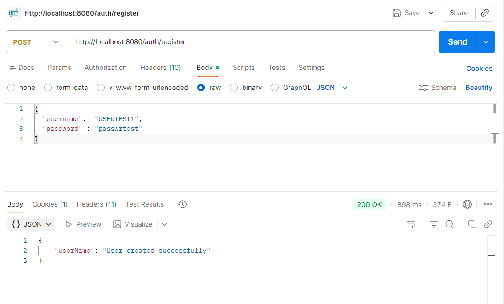
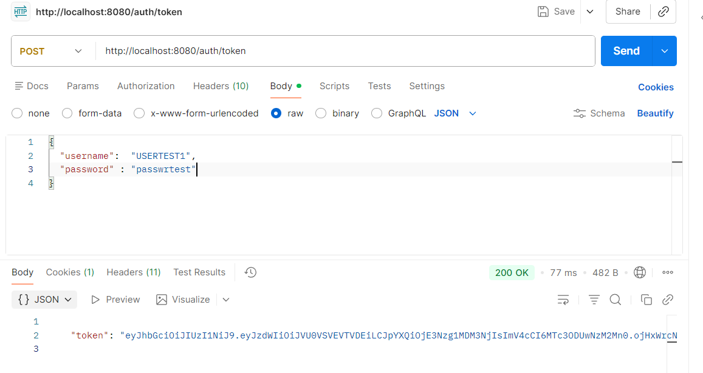
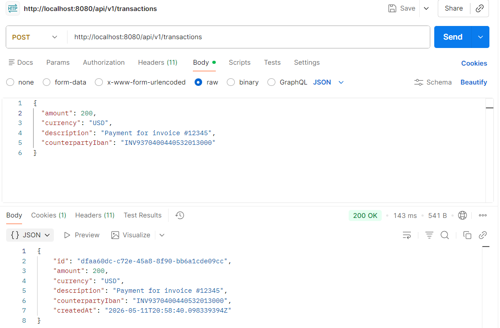
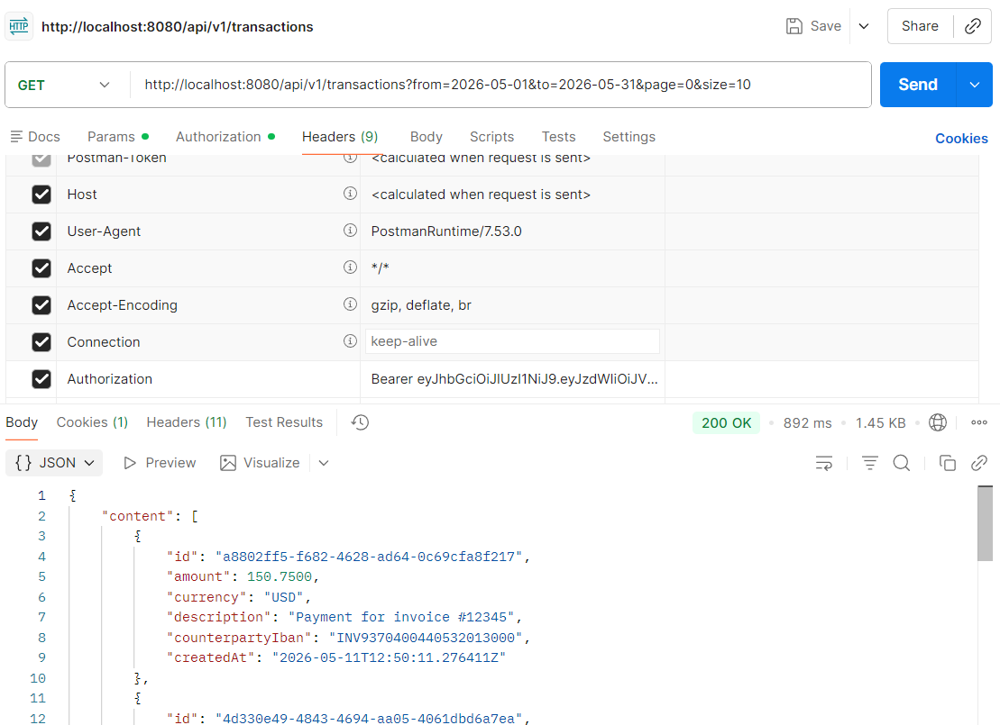
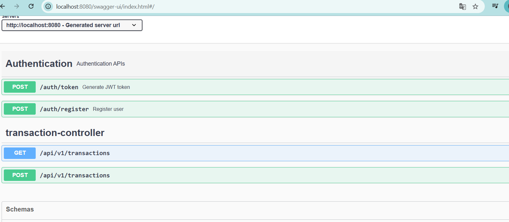
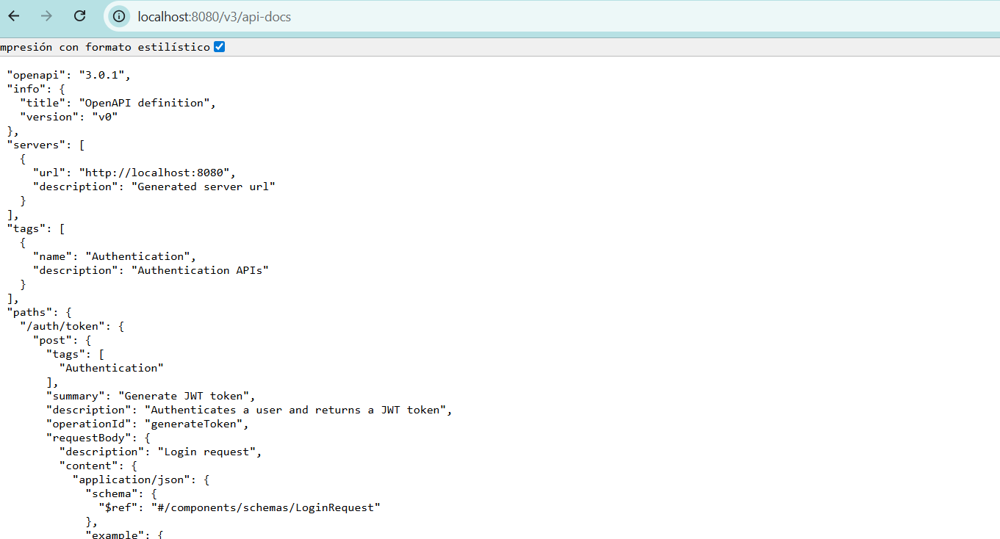

# Project Transaction Ledger Service

A Spring Boot-based RESTful service for creating and retrieving transactions for an authenticated user while ensuring the solution is scalable, secure performant and well documented.

The purpose of these file is to instruct on how to have the banking-service up and running as per the challenge requirement

---

## Features

- Transaction API: Create an endpoint to POST a transaction with the following
  information : Amount, Currency, Description and Counterparty IBAN.
- Audit History: Create a GET endpoint to retrieve a paginated list of transactions for
  the authenticated user.
- Validation: Ensure the amount is always positive and the IBAN follows a basic
  format. Add additional validations that you might deem necessary.
- Clean code with DTOs, wrapping responses, and exception handling, also externalized configurations via Environment variables

---

## Non Technical Requirements

- Security: Implement Basic Auth or JWT. Ensure a user can only see their own
transactions (Broken Object Level Authorization prevention).
- Performance: Ensure that when retrieving transactions within a specific date range,
it is optimized (hint: indexing).
- Database Migration: Include a schema.sql or use Liquibase/Flyway for
database versioning.
- Use Postgres. Use JPA/Hibernate/jOOQ to manage two entities: User
  and Transaction .

---

## Tech Stack

- Java 17 (Java 8 language features)
- Spring Boot 3
- Spring Web / Spring Data JPA
- PostgreSQL
- Flyway
- Swagger (OpenAPI)

---

#### Prerequisites:

- Java 17, with Java 8 language-level support
- Docker + Docker Compose
- Reuse or provide your own Environment variables by using the .env file provided in the docker directory

#### Take into Account:

- We'll use BOLA for this assignment in order to ensure only authenticated user can see their own transactions.
- By using JWT , we'll enforce that only certain APIs will require authorization, for that we'll provide 2 extra endpoints to create and generate token for a user
- We'll use the Authentication object attached to the user, to execute the operations.
- The design of the APIs have to be in a way that no sensitive data is leaked, for instance no userId or accountId has to be part of the API path or be sent as query parans

---

#### Steps

### 1. Clone the repo:

git clone https://github.com/josecan2604/transaction-banking-service.git

### 2. Run the following command:

        cd docker  
        docker-compose up 
            #### This will look for the dcker-compose file, file that contains all necesary configurations to init the services, and init banking-service and postgres as a stack picking the values in the .env file

### 3. Test the endpoints

|     | Endpoint               |                                                |
|-----|------------------------|------------------------------------------------|
| POST | `/auth/register`       | Create a User                                  |
| POST | `/auth/token`          | Generate an Access Token for further API calls |
| POST | `/api/v1/transactions` | Create a Transaction                           |
| GET  | `/api/v1/transactions` | List  transactions                             |

A.- POST  `/auth/register`     | Create a User
Supports the flow to create a user. No authentication is required

B.= | POST  | `/auth/token`    | Generate JWT token                    
Now that we have the user created we'll require a token to use the transaction APIs.

C.- | POST  | `/api/v1/transactions` | Create a transaction for an authenticated user Requires a JWT token
Supports validations like the IBAN in a specific format, amount greater than 0

C.- | GET  | `/api/v1/transactions` | List a transaction for an authenticated user
You can retrieve transactions attached to the current user, feature supports pagination and the query parans are indexed in the database

Extras

Swagger UI=

v3/docs=

TEST THE APIS
The collection to test the APIs are in the 'apis-test' folder

Thanks
